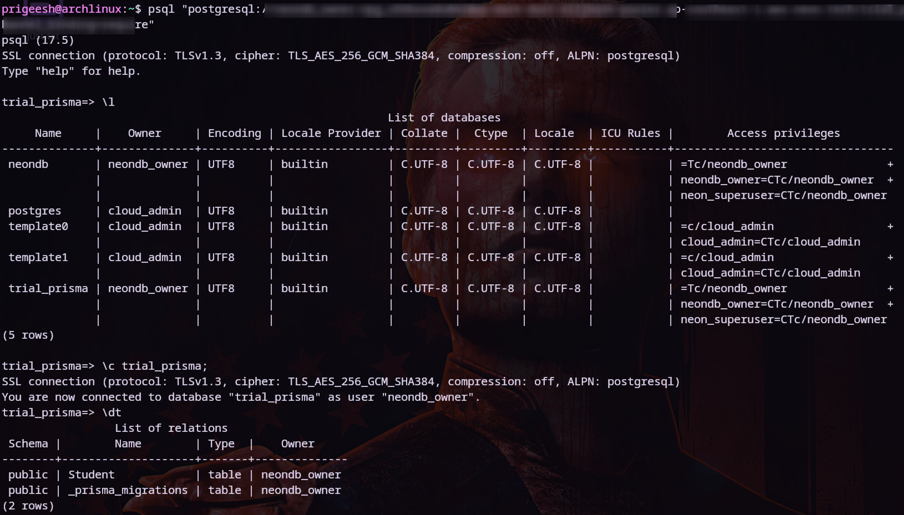

## 📄 README.md

```
🚀 Backend Hands-On (Express + TypeScript + Prisma + NeonDB)

A simple CRUD backend built with **Express**, **TypeScript**, and **Prisma ORM**, connected to a **Neon PostgreSQL (cloud DB)**.  
This project demonstrates schema management, migrations, seeding, and REST API routes for a `Student` model.

---

## 📂 Project Structure

```

backend-hands-on/
├─ dist/              
├─ node\_modules/
├─ prisma/            # Prisma schema, migrations & seed data
│   ├─ migrations/
│   ├─ schema.prisma
│   └─ seed.ts
├─ routes.ts          
├─ server.ts          
├─ tsconfig.json     
├─ package.json
└─ package-lock.json

````

---

## ⚙️ Setup Instructions

### 1. Clone and Install
```bash
git clone <repo-url>
cd backend-hands-on
npm install
````

### 2. Configure Database

* Create a `.env` file in the project root:

```env
DATABASE_URL="postgresql://<user>:<password>@<host>/<dbname>?sslmode=require"
```

👉 Use your **Neon PostgreSQL connection string** here.

### 3. Prisma Setup

* Push schema to DB (or use migrations):

```bash
npx prisma db push
```

* (Optional) Apply migrations:

```bash
npx prisma migrate dev --name init
```

* Generate Prisma client:

```bash
npx prisma generate
```

### 4. Seed Dummy Data

```bash
npm run seed
```

---

## ▶️ Running the Project

### Development

```bash
npm run dev
```

Starts server with **ts-node-dev** (hot reload).

### Build

```bash
npm run build
```

Compiles TypeScript → `dist/`.

### Production

```bash
npm start
```

Runs compiled JS (`dist/server.js`).

---

## 📡 API Endpoints (Student CRUD)

| Method | Endpoint           | Description           |
| ------ | ------------------ | --------------------- |
| POST   | `/api/student`     | Create new student    |
| GET    | `/api/students`    | Get all students      |
| GET    | `/api/student/:id` | Get one student by ID |
| PUT    | `/api/student/:id` | Update a student      |
| DELETE | `/api/student/:id` | Delete a student      |

### Example Request (POST /api/student)

```json
{
  "name": "Alice",
  "DOB": "2000-05-15",
  "email": "alice@example.com"
}
```

---

## 🛠 Useful Prisma Commands

* `npx prisma studio` → Open Prisma Studio (UI for DB)
* `npx prisma db pull` → Pull DB schema into `schema.prisma`
* `npx prisma migrate dev --name <change>` → Create & apply migration
* `npx prisma migrate deploy` → Deploy all migrations (prod)
* `npx prisma db reset` → Reset DB & reapply migrations

---

## ✅ Tech Stack

* **Node.js / Express** → Backend framework
* **TypeScript** → Strong typing
* **Prisma ORM** → Database access & schema management
* **Neon PostgreSQL** → Cloud-hosted PostgreSQL database

Also can manage it via CLI if you likely to manage it here:



---

## 👤 Author

[**Prigeesh**](https://github.com/Sai-guru)

Arch Linux | TypeScript | Prisma | PostgreSQL

Always fell free to discuss...

---
